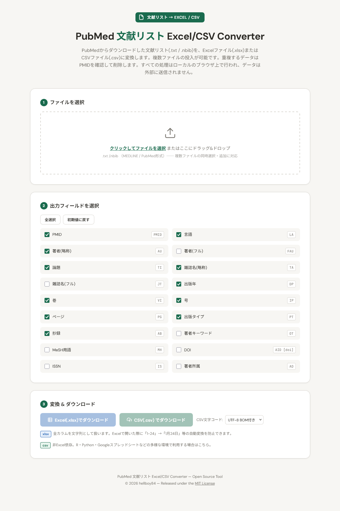
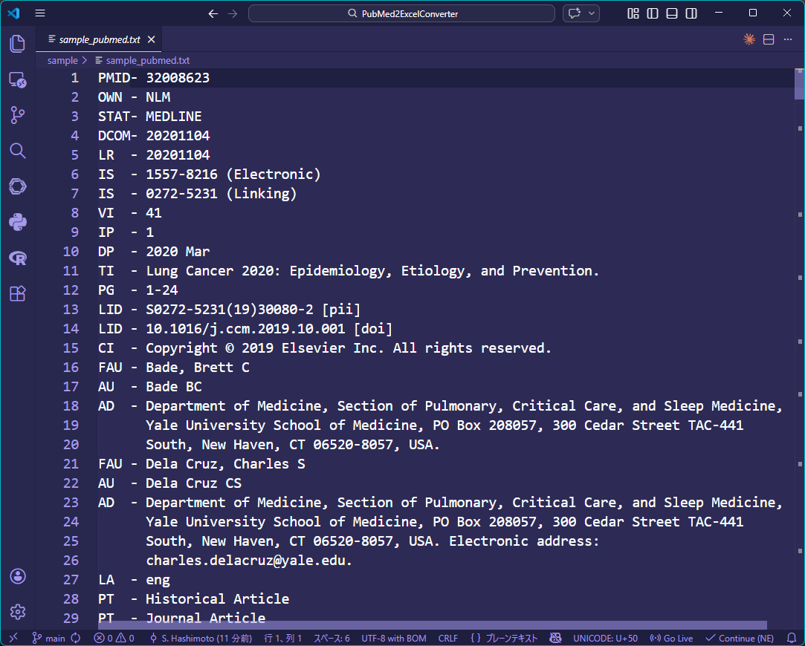
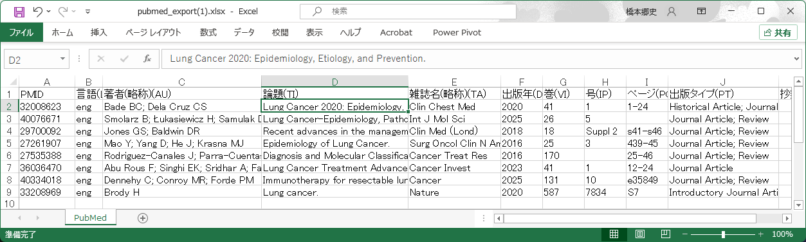

# PubMed2ExcelConverter

- **「PubMed 文献リスト Excel/CSV Converter」**
- PubMed からダウンロードした文献リストファイル（.txt / .nbib）を Excel（.xlsx）や CSV（.csv）に変換するHTMLツールです。HTML一個で動作します。

- ブラウザ拡張機能版はこちらです。[PubMed2ExcelDownloader](https://github.com/hellboy84/PubMed2ExcelDownloader)

## 特徴

- 複数の文献リストファイルを同時に処理可能です (結果は1ファイルにまとまります)。
- 重複文献は自動削除されます (PMIDで同定します)。
- 3万字以上のセルができた場合 (時々ある) 3万字で切り詰めます。
- 外部へのデータ送信は一切行いません。

## 使い方

0. [`pubmed2excel.html`](https://github.com/hellboy84/PubMed2ExcelConverter/blob/main/pubmed2excel.html) をダウンロードして，ブラウザで開く
1. **ファイルを選択** — PubMed からダウンロードした文献リストファイル `.txt` / `.nbib` を投入する。
2. **出力フィールドを選択** — デフォルトで主項目にチェックが入っているのでそのままでも。任意で変更可能。
3. **変換＆ダウンロード** — Excel(.xlsx) または CSV(.csv) ボタンをクリックする。

**デモ版はこちら ↓ (実利用時は自分のPC上で使うて下さい)** : [動作確認用SAMPLEデータはこちら](sample/sample_pubmed.txt) 

## 得られる成果物イメージ

これが

↓  
こうなる(エクセルの場合)

## 出力フィールド一覧

| フィールド | タグ | デフォルト |
|---|---|---|
| PMID | PMID | ✔ |
| 言語 | LA | ✔ |
| 著者(略称) | AU | ✔ |
| 著者(フル) | FAU | |
| 論題 | TI | ✔ |
| 雑誌名(略称) | TA | ✔ |
| 雑誌名(フル) | JT | |
| 出版年 | DP | ✔ |
| 巻 | VI | ✔ |
| 号 | IP | ✔ |
| ページ | PG | ✔ |
| 出版タイプ | PT | ✔ |
| 抄録 | AB | ✔ |
| 著者キーワード | OT | |
| MeSH 用語 | MH | |
| DOI | AID | |
| ISSN | IS | |
| 著者所属 | AD | |

## AI利用

このツールの作成はAIによるコーディング支援を受けています。

## ライセンス

[MIT License](LICENSE)

